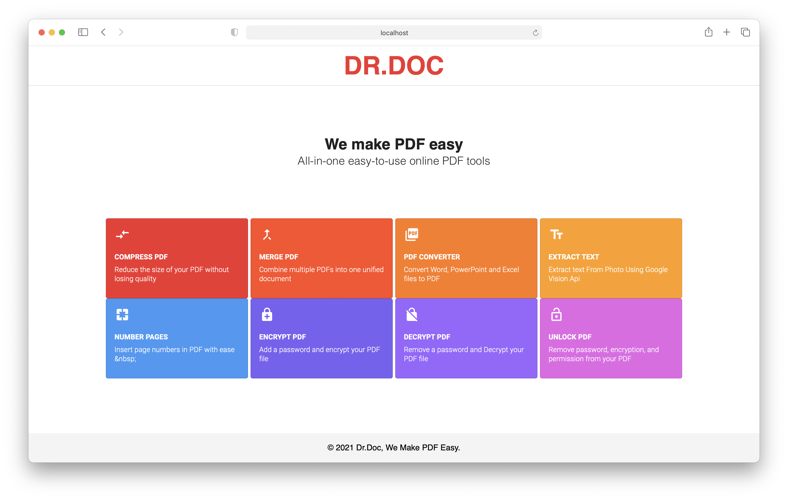
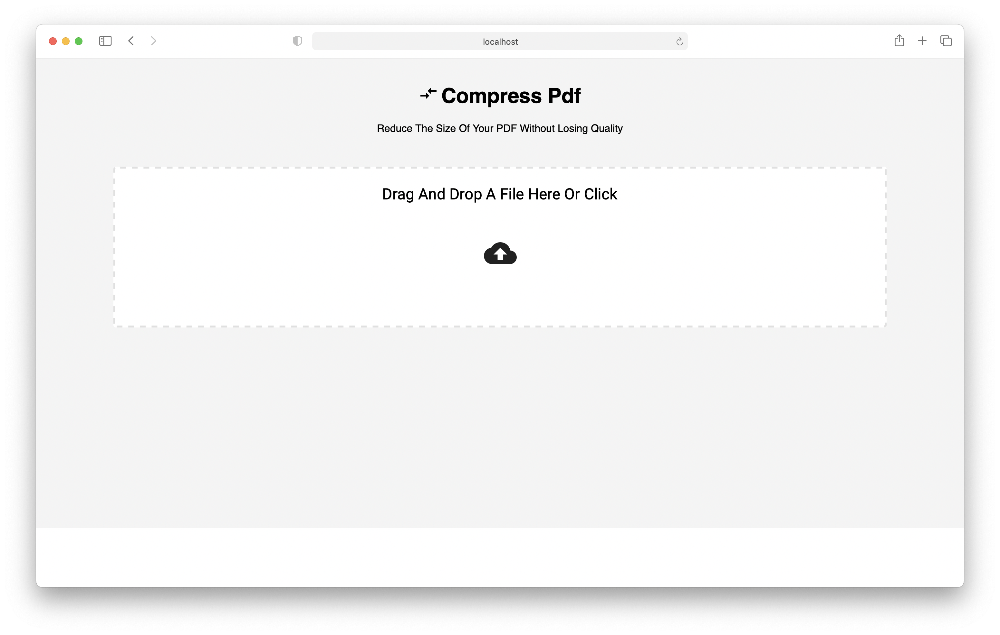

# Dr.DOC

* The WebApp developed in React.js and Node.js will provide the features like 
 * Scanning paper to get digital text
 * Storing it as PDF files
 * Sharing and other functionalities.
 * Handwritten text Recognition, Merge, Convert, Compress.

## Frontend

### local setup  instructions

> cd ./frontend  
> npm install  
> npm start  

### screenshots

## Backend

### local setup  instructions

#### create API key files

* see the demo files.
* Create a `dev.env` file in `root`( here `/backend`) which Includes All the API Keys(you need to create developer account on convert Api and ilovepdf api for all api keys)
* Create a `dev.env` file in `root`( here `/backend`) which Includes All the API Keys
* create `g_client.json` file in `/src` (here `/backend/src`) Which Include All The gVision API Keys.

#### installing dependencies

* install npm modules, from `/backend` folder here
> root/backend$ npm install
* needs node version >= v12.18.3

#### starting local API server

> npm start
* may start on `localhost:3050` or at specified port

### API routes

| name | method | route | working | 
| :---: | :---: | :---: | :---: |
| pdf merge | post | localhost:3050/merge | Yes |
| files to pdf | post | localhost:3050/convert | Yes |
| text reco. from photo | post | localhost:3050/upload | Yes |
| pdf compression | post | localhost:3050/compression | Yes |
| add page number | post | localhost:3050/pageNumber | Yes |
| encrypt pdf | post | localhost:3050/encrypt | No |
| decrypt pdf | post | localhost:3050/decrypt | Yes |
| unlock pdf | post | localhost:3050/unlock | Yes |

* Output files will be stored at `backend/src/public/output` folder.
* Test documents can be found at `/test documents` folder.
